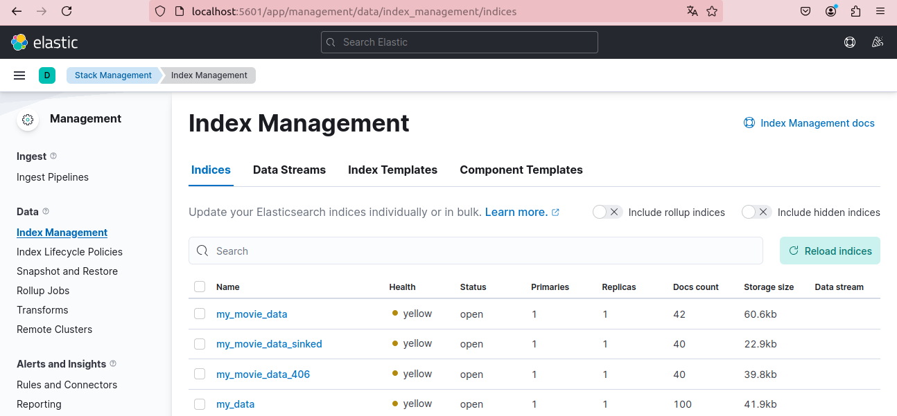
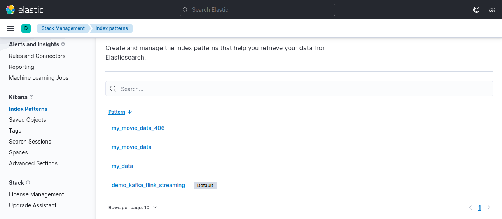
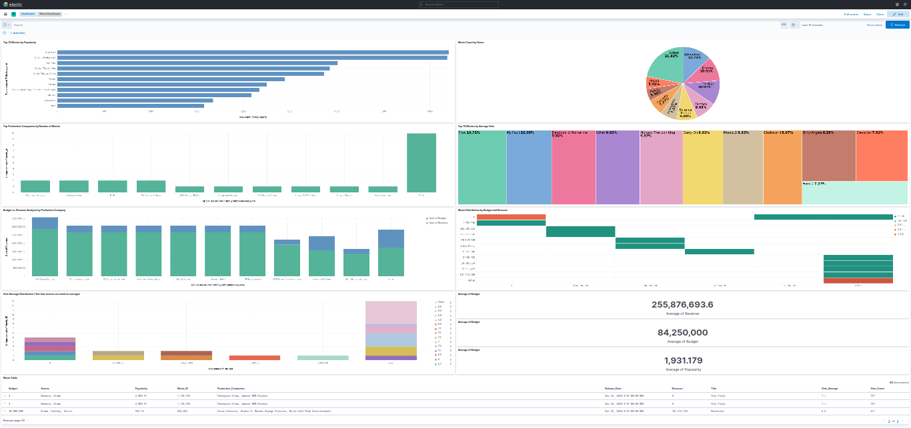
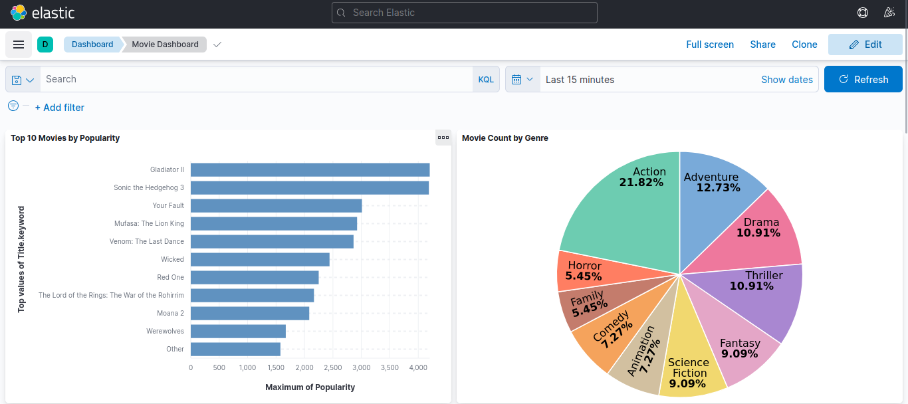
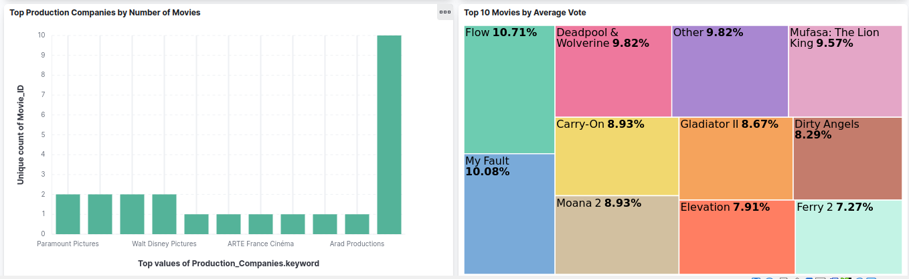
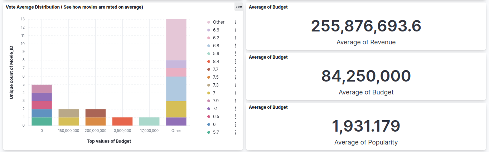
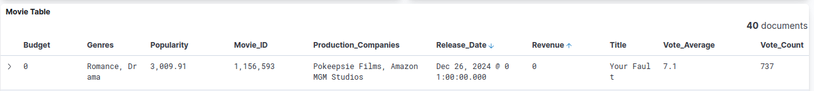

# Real-Time Data Pipeline with Kafka, Flink, Elasticsearch, and TMDB API

## Overview:
This project sets up a real-time data streaming pipeline designed to process, store, and visualize movie-related data. The system utilizes a combination of powerful tools:
- **Kafka** for handling real-time, data streams.
- **Flink** for performing data processing in real-time, enabling insights and analytics.
- **Elasticsearch** for indexing and querying large volumes of data efficiently.
- **Kibana** for visualizing the processed data through intuitive dashboards.
- **TMDB API** to fetch movie-related data like movie details, ratings, and reviews.

The goal is to create an efficient pipeline that ingests real-time movie data, processes it, and displays visual analytics using Elasticsearch and Kibana. You can customize and extend this setup with additional tools, but ensure compatibility among all the components.


This guide outlines the steps to implement and work with this pipeline, including the integration of the **TMDB API** for retrieving movie data. Feel free to modify or extend this setup to fit your project requirements, but be sure to ensure compatibility across tools and technologies. 

---

Let me know if you need further adjustments!


## **TMDB** API

- **How to Get Your TMDB API Key:**

    To access data from the TMDB (The Movie Database) API, you need an API key. Here’s how you can get one:

    1. **Sign Up for an Account**: Go to the [TMDB website](https://www.themoviedb.org/) and create an account.
    2. **Generate an API Key**: Once logged in, go to the **API** section under your account settings:  
       [TMDB API Section](https://www.themoviedb.org/settings/api)
    3. **Create a New API Key**: Follow the instructions to create an API key. Once created, you'll receive a unique API key that you can use to make requests to the TMDB API.

    ```bash
    "YOUR_TMDB_API_KEY"
    ```

    Replace `"YOUR_TMDB_API_KEY"` with the key you obtained from TMDB.

- **API Request Example**:  
    Once you have the API key, you can make requests to fetch data. For instance, to get details of a specific movie, you can use the following request:

    ```bash
    curl -X GET "https://api.themoviedb.org/3/movie/550?api_key=YOUR_TMDB_API_KEY"
    ```

    Replace `"550"` with the desired movie ID (e.g., ID for "Fight Club").

- **Kafka Info**:
    - **Start Zookeeper**:  
    Kafka uses Zookeeper for distributed coordination. Start Zookeeper by running the following command from the Kafka directory:

        ```bash
        bin/zookeeper-server-start.sh config/zookeeper.properties
        ```
        
    - **Start Kafka Server**:  
    Open a new terminal and start the Kafka server with the following command:

        ```bash
        bin/kafka-server-start.sh config/server.properties
        ```

    - **Create a Topic**:  
    To create a Kafka topic named "tmdb_movies", run the following command:

        ```bash
        bin/kafka-topics.sh --create --topic tmdb_movies --bootstrap-server localhost:9092 --partitions 1 --replication-factor 1
        ```

    - **List Topics**:  
    To list all existing topics, run:

        ```bash
        bin/kafka-topics.sh --list --bootstrap-server localhost:9092
        ```

    - **Produce Messages**:  
    Use the following command to produce messages to the "**tmdb_movies**" topic:

        ```bash
        bin/kafka-console-producer.sh --topic tmdb_movies --bootstrap-server localhost:9092
        ```

    - **Consume Messages**:  
    Open a new terminal and run the following command to consume messages from the "tmdb_movies" topic:

        ```bash
        bin/kafka-console-consumer.sh --topic tmdb_movies --bootstrap-server localhost:9092 --from-beginning
        ```

- **Server Properties**:
    - **Default Configuration**:

        ```python
        # Listener name, hostname, and port the broker will advertise to clients.
        # If not set, it uses the value for "listeners".
        advertised.listeners=PLAINTEXT://your.host.name:9092
        ```

- ***My Kafka Info***:  
    After starting Zookeeper & Kafka, run the following commands:

        ```bash
        bin/zookeeper-server-start.sh config/zookeeper.properties
        bin/kafka-server-start.sh config/server.properties
        ```

    You should see the following output in the Kafka terminal:

        ```bash
        [2023-12-03 17:11:15,535] INFO Registered broker 0 at path /brokers/ids/0 with addresses: PLAINTEXT://PNS-VirtualBox:9092, czxid (broker epoch): 124 (kafka.zk.KafkaZkClient)
        
        default topic: 'tmdb_movies'
        bootstrap-server: 'PNS-VirtualBox:9092'
       ```

  - Read API data and send it to the Kafka Producer:

```python
import json
import requests
from kafka import KafkaProducer
from rich import print
from time import sleep

# TMDb API Key
API_KEY = "YOUR_API_KEY"
BASE_URL = "https://api.themoviedb.org/3"

# In-memory set to store movie IDs that have been processed
processed_movie_ids = set()

# Kafka Producer
producer = KafkaProducer(
    bootstrap_servers=['PNS-VirtualBox:9092'],
    value_serializer=lambda K: json.dumps(K).encode('utf-8')
)

# Fetch Popular Movies
def fetch_popular_movies(page=1):
    """
    Fetches popular movies from TMDb.
    """
    endpoint = f"{BASE_URL}/movie/popular"
    params = {
        "api_key": API_KEY,
        "language": "en-US",
        "page": page
    }
    response = requests.get(endpoint, params=params)

    if response.status_code == 200:
        return response.json().get("results", [])
    else:
        print(f"Error fetching popular movies. Status code: {response.status_code}")
        return []

# Fetch Detailed Movie Data
def fetch_movie_details(movie_id):
    endpoint = f"{BASE_URL}/movie/{movie_id}"
    params = {"api_key": API_KEY}
    response = requests.get(endpoint, params=params)

    if response.status_code == 200:
        return response.json()
    else:
        print(f"Error fetching details for Movie ID {movie_id}. Status code: {response.status_code}")
        return {}

# Process Movie Data and Send to Kafka
def process_and_send_movies():
    """
    Processes movie data and sends to Kafka.
    """
    popular_movies = fetch_popular_movies()
    for movie in popular_movies:
        movie_id = movie["id"]
        # Check if the movie has already been processed
            
        movie_details = fetch_movie_details(movie_id)

        if movie_details:
            movie_data = {
                "Movie_ID": movie_id,
                "Title": movie["title"],
                "Release_Date": movie["release_date"],
                "Genres": [genre["name"] for genre in movie_details.get("genres", [])],
                "Vote_Average": movie["vote_average"],
                "Vote_Count": movie["vote_count"],
                "Popularity": movie["popularity"],
                "Budget": movie_details.get("budget", "N/A"),
                "Revenue": movie_details.get("revenue", "N/A"),
                "Production_Companies": [
                    company["name"] for company in movie_details.get("production_companies", [])
                ],
            }

            # Send data to Kafka topic
            producer.send('tmdb_movies', value=movie_data)
            print(json.dumps(movie_data, indent=2)
            sleep(1)  # Simulate interval between sending messages

# Run the movie data processing
process_and_send_movies()
```
    
- Kafka Consumer
    
```bash
 # Import necessary libraries
from kafka import KafkaConsumer
from json import loads
from rich import print

# Create a Kafka consumer
consumer = KafkaConsumer(
    'tmdb_movies',  # Topic to consume messages from
    bootstrap_servers=['PNS-VirtualBox:9092'],  # Kafka server addresses
    auto_offset_reset='earliest',  # Reset offset to the latest available message
    enable_auto_commit=True,  # Enable auto commit of consumed messages
    group_id=None,  # Consumer group ID (None indicates an individual consumer)
    value_deserializer=lambda x: loads(x.decode('utf-8'))  # Deserialize the message value from JSON to Python object
)

# Process incoming messages
for message in consumer:
    data = message.value  # Get the value of the message (tweet)
    print(data)  # Print the tweet
```
    
- check if the consumer got the data
        
        ```bash
        bin/kafka-console-consumer.sh --topic tmdb_movies-test --bootstrap-server ilyas-VirtualBox:9092 --from-beginning
        ```
- The output will looklike this : 

  ```bash
    {
      "Movie_ID": 558449,
      "Title": "Gladiator II",
      "Release_Date": "2024-11-05",
      "Genres": [
        "Action",
        "Adventure",
        "Drama"
      ],
      "Vote_Average": 6.8,
      "Vote_Count": 2104,
      "Popularity": 4201.992,
      "Budget": 310000000,
      "Revenue": 449835755,
      "Production_Companies": [
        "Paramount Pictures",
        "Scott Free Productions",
        "Lucy Fisher/Douglas Wick Productions"
      ]
    }
    {
      "Movie_ID": 939243,
      "Title": "Sonic the Hedgehog 3",
      "Release_Date": "2024-12-19",
      "Genres": [
        "Action",
        "Science Fiction",
        "Comedy",
        "Family"
      ],
      "Vote_Average": 7.7,
      "Vote_Count": 386,
      "Popularity": 4186.749,
      "Budget": 122000000,
      "Revenue": 338215740,
      "Production_Companies": [
        "Paramount Pictures",
        "Original Film",
        "Marza Animation Planet",
        "SEGA",
        "Blur Studio",
        "SEGA of America"
      ]
    }
    {
      "Movie_ID": 1156593,
      "Title": "Your Fault",
      "Release_Date": "2024-12-26",
      "Genres": [
        "Romance",
        "Drama"
      ],
      "Vote_Average": 7.133,
      "Vote_Count": 737,
      "Popularity": 3009.907,
      "Budget": 0,
      "Revenue": 0,
      "Production_Companies": [
        "Pokeepsie Films",
        "Amazon MGM Studios"
      ]
    }
    {
      "Movie_ID": 762509,
      "Title": "Mufasa: The Lion King",
      "Release_Date": "2024-12-18",
      "Genres": [
        "Adventure",
        "Family",
        "Animation"
      ],
      "Vote_Average": 7.5,
      "Vote_Count": 498,
      "Popularity": 2924.518,
      "Budget": 200000000,
      "Revenue": 478145305,
      "Production_Companies": [
        "Walt Disney Pictures"
      ]
    }
    {
      "Movie_ID": 912649,
      "Title": "Venom: The Last Dance",
      "Release_Date": "2024-10-22",
      "Genres": [
        "Action",
        "Science Fiction",
        "Adventure"
      ],
      "Vote_Average": 6.814,
      "Vote_Count": 2195,
      "Popularity": 2862.276,
      "Budget": 120000000,
      "Revenue": 476391878,
      "Production_Companies": [
        "Columbia Pictures",
        "Pascal Pictures",
        "Matt Tolmach Productions",
        "Hutch Parker Entertainment",
        "Arad Productions"
      ]
    }
    {
      "Movie_ID": 845781,
      "Title": "Red One",
      "Release_Date": "2024-10-31",
      "Genres": [
        "Action",
        "Fantasy",
        "Comedy"
      ],
      "Vote_Average": 7.0,
      "Vote_Count": 1882,
      "Popularity": 2249.629,
      "Budget": 250000000,
      "Revenue": 182861176,
      "Production_Companies": [
        "Seven Bucks Productions",
        "The Detective Agency",
        "Chris Morgan Productions",
        "Metro-Goldwyn-Mayer"
      ]
    }
    {
      "Movie_ID": 402431,
      "Title": "Wicked",
      "Release_Date": "2024-11-20",
      "Genres": [
        "Drama",
        "Romance",
        "Fantasy"
      ],
      "Vote_Average": 7.3,
      "Vote_Count": 1078,
      "Popularity": 2440.1,
      "Budget": 150000000,
      "Revenue": 681385955,
      "Production_Companies": [
        "Universal Pictures",
        "Marc Platt Productions"
      ]
    }
    {
      "Movie_ID": 839033,
      "Title": "The Lord of the Rings: The War of the Rohirrim",
      "Release_Date": "2024-12-05",
      "Genres": [
        "Animation",
        "Fantasy",
        "Action",
        "Adventure"
      ],
      "Vote_Average": 6.6,
      "Vote_Count": 251,
      "Popularity": 2166.194,
      "Budget": 30000000,
      "Revenue": 19891554,
      "Production_Companies": [
        "New Line Cinema",
        "Warner Bros. Animation",
        "Sola Entertainment",
        "Middle-earth Enterprises",
        "WingNut Films",
        "Domain Entertainment"
      ]
    }
    {
      "Movie_ID": 1241982,
      "Title": "Moana 2",
      "Release_Date": "2024-11-21",
      "Genres": [
        "Animation",
        "Adventure",
        "Family",
        "Comedy"
      ],
      "Vote_Average": 7.0,
      "Vote_Count": 781,
      "Popularity": 2083.288,
      "Budget": 150000000,
      "Revenue": 961922690,
      "Production_Companies": [
        "Walt Disney Pictures",
        "Walt Disney Animation Studios",
        "Walt Disney Animation Studios"
      ]
    }
    {
      "Movie_ID": 1035048,
      "Title": "Elevation",
      "Release_Date": "2024-11-07",
      "Genres": [
        "Action",
        "Science Fiction",
        "Thriller"
      ],
      "Vote_Average": 6.23,
      "Vote_Count": 280,
      "Popularity": 1576.453,
      "Budget": 18000000,
      "Revenue": 3300000,
      "Production_Companies": [
        "Lyrical Media",
        "Fuller Media",
        "Inspire Entertainment",
        "Grinder Monkey",
        "John Glenn Entertainment"
      ]
    }
    {
      "Movie_ID": 970450,
      "Title": "Werewolves",
      "Release_Date": "2024-12-04",
      "Genres": [
        "Action",
        "Horror",
        "Thriller"
      ],
      "Vote_Average": 6.041,
      "Vote_Count": 121,
      "Popularity": 1670.395,
      "Budget": 0,
      "Revenue": 1052998,
      "Production_Companies": [
        "The Solution",
        "Pimienta",
        "Monty the Dog Productions"
      ]
    }
    {
      "Movie_ID": 1043905,
      "Title": "Dirty Angels",
      "Release_Date": "2024-12-11",
      "Genres": [
        "Action",
        "Drama",
        "Thriller"
      ],
      "Vote_Average": 6.546,
      "Vote_Count": 98,
      "Popularity": 1354.815,
      "Budget": 0,
      "Revenue": 0,
      "Production_Companies": [
        "Millennium Media",
        "Nu Boyana Film Studios",
        "I Road Productions"
      ]
    }
    {
      "Movie_ID": 1005331,
      "Title": "Carry-On",
      "Release_Date": "2024-12-05",
      "Genres": [
        "Action",
        "Thriller"
      ],
      "Vote_Average": 6.956,
      "Vote_Count": 1493,
      "Popularity": 1228.88,
      "Budget": 47000000,
      "Revenue": 0,
      "Production_Companies": [
        "Dylan Clark Productions",
        "DreamWorks Pictures"
      ]
    }
    {
      "Movie_ID": 1010581,
      "Title": "My Fault",
      "Release_Date": "2023-06-08",
      "Genres": [
        "Romance",
        "Drama"
      ],
      "Vote_Average": 7.9,
      "Vote_Count": 3330,
      "Popularity": 1054.65,
      "Budget": 0,
      "Revenue": 0,
      "Production_Companies": [
        "Pokeepsie Films",
        "Amazon Studios"
      ]
    }
    {
      "Movie_ID": 823219,
      "Title": "Flow",
      "Release_Date": "2024-01-30",
      "Genres": [
        "Animation",
        "Fantasy",
        "Adventure"
      ],
      "Vote_Average": 8.4,
      "Vote_Count": 570,
      "Popularity": 1109.247,
      "Budget": 3500000,
      "Revenue": 6831946,
      "Production_Companies": [
        "Dream Well Studio",
        "Sacrebleu Productions",
        "Take Five",
        "ARTE France Cin\u00e9ma",
        "RTBF"
      ]
    }
    {
      "Movie_ID": 933260,
      "Title": "The Substance",
      "Release_Date": "2024-09-07",
      "Genres": [
        "Horror",
        "Science Fiction"
      ],
      "Vote_Average": 7.1,
      "Vote_Count": 3067,
      "Popularity": 1086.872,
      "Budget": 17500000,
      "Revenue": 78011465,
      "Production_Companies": [
        "Working Title Films",
        "Blacksmith",
        "Working Title Films"
      ]
    }
    {
      "Movie_ID": 426063,
      "Title": "Nosferatu",
      "Release_Date": "2024-12-25",
      "Genres": [
        "Drama",
        "Fantasy",
        "Horror"
      ],
      "Vote_Average": 6.8,
      "Vote_Count": 617,
      "Popularity": 952.121,
      "Budget": 50000000,
      "Revenue": 101613765,
      "Production_Companies": [
        "Focus Features",
        "Studio 8",
        "Maiden Voyage Pictures",
        "Birch Hill Road Entertainment"
      ]
    }
    {
      "Movie_ID": 533535,
      "Title": "Deadpool & Wolverine",
      "Release_Date": "2024-07-24",
      "Genres": [
        "Action",
        "Comedy",
        "Science Fiction"
      ],
      "Vote_Average": 7.7,
      "Vote_Count": 6267,
      "Popularity": 856.096,
      "Budget": 200000000,
      "Revenue": 1338073645,
      "Production_Companies": [
        "Marvel Studios",
        "Maximum Effort",
        "21 Laps Entertainment",
        "20th Century Studios",
        "Kevin Feige Productions",
        "TSG Entertainment"
      ]
    }
    {
      "Movie_ID": 1000075,
      "Title": "The Price of Money: A Largo Winch Adventure",
      "Release_Date": "2024-07-31",
      "Genres": [
        "Action",
        "Adventure",
        "Thriller"
      ],
      "Vote_Average": 5.928,
      "Vote_Count": 83,
      "Popularity": 735.391,
      "Budget": 17000000,
      "Revenue": 0,
      "Production_Companies": [
        "Pan-Europ\u00e9enne",
        "Versus Production",
        "TF1 Films Production",
        "RTBF",
        "BeTV",
        "Proximus",
        "Canal+",
        "la Fe\u0301de\u0301ration Wallonie- Bruxelles",
        "Cin\u00e9+",
        "screen.brussels",
        "Wild Bunch",
        "Wallimage"
      ]
    }
    {
      "Movie_ID": 1276945,
      "Title": "Ferry 2",
      "Release_Date": "2024-12-19",
      "Genres": [
        "Crime",
        "Thriller",
        "Action"
      ],
      "Vote_Average": 5.7,
      "Vote_Count": 76,
      "Popularity": 873.984,
      "Budget": 0,
      "Revenue": 0,
      "Production_Companies": [
        "De Mensen",
        "VRT"
      ]
    }
    ```
## **kafka** & **Flink** streaming
### Installation Requirements

- **Compatibility**: Ensure `**apache-flink**`, `**Pyflink**`, and `**flink-sql-connector-kafka-1.16.3.jar**` are all the same version.

1. **Install Flink**:
    - Follow this tutorial: [Flink Installation Guide](https://www.youtube.com/watch?v=6uW6u_zuloo)
    - To start the cluster:
        ```bash
        cd flink
        ./bin/start-cluster.sh
        # Access the interface at localhost:8081
        ```
    - To stop the cluster:
        ```bash
        ./bin/stop-cluster.sh
        ```

2. **Ensure Python 3 is Installed**:
    ```bash
    python3 --version
    # If needed, install Python 3:
    sudo apt update
    sudo apt install python3
    sudo apt dist-upgrade
    ```

3. **Install `pip3`**:
    ```bash
    pip3 --version
    ```

4. **Install PyFlink**:
    ```bash
    pip3 install apache-flink
    # Verify installation
    pip3 show apache-flink
    ```

    - Check if PyFlink is installed by importing:
        ```python
        from pyflink.table import TableEnvironment, EnvironmentSettings
        ```

5. **Install Flink Kafka Connector**:
    - Download the compatible Kafka connector for Flink from [Maven Repository](https://mvnrepository.com/artifact/org.apache.flink/flink-sql-connector-kafka).
    - After downloading, add the connector’s path:
        ```bash
        "file://path to flink kafka connector jar"
        ```

### Setup

- If PyFlink is correctly installed, the following line should not be marked:
    ```bash
    from pyflink.table import TableEnvironment, EnvironmentSettings
    ```

6. Add the path to the Flink Kafka connector JAR:
    ```bash
    "file://path to flink kafka connector jar"
    ```
     
        ```bash
        # example
        
        CREATE TABLE source_table(
        .....
            ) WITH (
                'connector' = 'kafka',
                'topic' = '<your topic name>',
                'properties.bootstrap.servers' = 'localhost:9092',
                'properties.group.id' = 'test',
                'scan.startup.mode' = 'latest-offset',
                'format' = 'json'
            )
            ```
        
    - before execution make sure you have **`flink`** & **`kafka`** started
    - run the Producer file first then `kafka_flink_movie.py`
```python
from pyflink.table import TableEnvironment, EnvironmentSettings

# Create a TableEnvironment
env_settings = EnvironmentSettings.in_streaming_mode()
t_env = TableEnvironment.create(env_settings)

# Specify connector and format jars
t_env.get_config().get_configuration().set_string(
    "pipeline.jars",
    "file:///home/user/Téléchargements/flink-sql-connector-kafka-3.4.0-1.20.jar"
)

# Define source table DDL
source_ddl = """
    CREATE TABLE source_table_movie (
	  
            Movie_ID BIGINT,
            Title VARCHAR(255),
            Release_Date VARCHAR(255),
            Genres ARRAY<VARCHAR(255)>,
            Vote_Average DECIMAL(3, 1),
            Vote_Count INT,
            Popularity DECIMAL(10, 2),
            Budget BIGINT,
            Revenue BIGINT,
            Production_Companies ARRAY<VARCHAR(255)> -- Change to this format without spaces
    ) WITH (
        'connector' = 'kafka',
        'topic' = 'tmdb_movies',
        'properties.bootstrap.servers' = 'PNS-VirtualBox:9092',
        'properties.group.id' = 'test',
        'scan.startup.mode' = 'latest-offset',
        'format' = 'json'
    )
"""
# Execute DDL statement to create the source table
t_env.execute_sql(source_ddl)

# Retrieve the source table
source_table = t_env.from_path('source_table_movie')

print("Source Table Schema:")
source_table.print_schema()

# Define a SQL query to select all columns from the source table
sql_query = "SELECT * FROM source_table_movie"

# Execute the query and retrieve the result table
result_table = t_env.sql_query(sql_query)

# Print the result table to the console
result_table.execute().print()
```
- The output:
```bash
Source Table Schema:
(
  `Movie_ID` BIGINT,
  `Title` VARCHAR(255),
  `Release_Date` VARCHAR(255),
  `Genres` ARRAY<VARCHAR(255)>,
  `Vote_Average` DECIMAL(3, 1),
  `Vote_Count` INT,
  `Popularity` DECIMAL(10, 2),
  `Budget` BIGINT,
  `Revenue` BIGINT,
  `Production_Companies` ARRAY<VARCHAR(255)>
)
+----+----------------------+--------------------------------+--------------------------------+--------------------------------+--------------+-------------+--------------+----------------------+----------------------+--------------------------------+
| op |             Movie_ID |                          Title |                   Release_Date |                         Genres | Vote_Average |  Vote_Count |   Popularity |               Budget |              Revenue |           Production_Companies |
+----+----------------------+--------------------------------+--------------------------------+--------------------------------+--------------+-------------+--------------+----------------------+----------------------+--------------------------------+
| +I |              1156593 |                     Your Fault |                     2024-12-26 |               [Romance, Drama] |          7.1 |         747 |      3009.91 |                    0 |                    0 | [Pokeepsie Films, Amazon MG... |
| +I |               762509 |          Mufasa: The Lion King |                     2024-12-18 | [Adventure, Family, Animation] |          7.4 |         511 |      2924.52 |            200000000 |            478145305 |         [Walt Disney Pictures] |
| +I |               912649 |          Venom: The Last Dance |                     2024-10-22 | [Action, Science Fiction, A... |          6.8 |        2203 |      2862.28 |            120000000 |            478100622 | [Columbia Pictures, Pascal ... |
| +I |               402431 |                         Wicked |                     2024-11-20 |      [Drama, Romance, Fantasy] |          7.3 |        1085 |      2440.10 |            150000000 |            681385955 | [Universal Pictures, Marc P... |
| +I |               845781 |                        Red One |                     2024-10-31 |      [Action, Fantasy, Comedy] |          7.0 |        1890 |      2249.63 |            250000000 |            182861176 | [Seven Bucks Productions, T... |
| +I |               839033 | The Lord of the Rings: The ... |                     2024-12-05 | [Animation, Fantasy, Action... |          6.6 |         254 |      2166.19 |             30000000 |             19891554 | [New Line Cinema, Warner Br... |
| +I |              1241982 |                        Moana 2 |                     2024-11-21 | [Animation, Adventure, Fami... |          7.0 |         784 |      2083.29 |            150000000 |            961922690 | [Walt Disney Pictures, Walt... |
| +I |               970450 |                     Werewolves |                     2024-12-04 |     [Action, Horror, Thriller] |          6.1 |         127 |      1670.40 |                    0 |              1052998 | [The Solution, Pimienta, Mo... |
| +I |              1035048 |                      Elevation |                     2024-11-07 | [Action, Science Fiction, T... |          6.2 |         287 |      1576.45 |             18000000 |              3300000 | [Lyrical Media, Fuller Medi... |
| +I |              1043905 |                   Dirty Angels |                     2024-12-11 |      [Action, Drama, Thriller] |          6.5 |         102 |      1354.82 |                    0 |                    0 | [Millennium Media, Nu Boyan... |
| +I |              1005331 |                       Carry-On |                     2024-12-05 |             [Action, Thriller] |          7.0 |        1503 |      1228.88 |             47000000 |                    0 | [Dylan Clark Productions, D... |
| +I |              1214667 | Making Squid Game: The Chal... |                     2023-12-06 |                  [Documentary] |          5.9 |          21 |      1112.19 |                    0 |                    0 |                             [] |
| +I |               823219 |                           Flow |                     2024-01-30 | [Animation, Fantasy, Advent... |          8.4 |         581 |      1109.25 |              3500000 |              6831946 | [Dream Well Studio, Sacrebl... |
| +I |               933260 |                  The Substance |                     2024-09-07 |      [Horror, Science Fiction] |          7.1 |        3087 |      1086.87 |             17500000 |             78011465 | [Working Title Films, Black... |
| +I |              1010581 |                       My Fault |                     2023-06-08 |               [Romance, Drama] |          7.9 |        3334 |      1054.65 |                    0 |                    0 | [Pokeepsie Films, Amazon St... |
| +I |               426063 |                      Nosferatu |                     2024-12-25 |       [Drama, Fantasy, Horror] |          6.9 |         647 |       952.12 |             50000000 |            101613765 | [Focus Features, Studio 8, ... |
| +I |              1276945 |                        Ferry 2 |                     2024-12-19 |      [Crime, Thriller, Action] |          5.7 |          77 |       873.98 |                    0 |                    0 |               [De Mensen, VRT] |
| +I |               533535 |           Deadpool & Wolverine |                     2024-07-24 | [Action, Comedy, Science Fi... |          7.7 |        6277 |       856.10 |            200000000 |           1338073645 | [Marvel Studios, Maximum Ef... |
```

## **elasticsearch** & **kibana**

- installation
1. installing elastic
        
        ```bash
        wget https://artifacts.elastic.co/downloads/elasticsearch/elasticsearch-7.17.15-linux-x86_64.tar.gz
        ```
        
2. extract it
        
        ```bash
        tar -xzf elasticsearch-7.17.15-linux-x86_64.tar.gz
        ```
        
3. navigate to it
        
        ```bash
        mv elasticsearch-7.17.15 elasticsearch
        cd elasticsearch
        ```
        
4. run elastic
        
        ```bash
        ./bin/elasticsearch
        ```
        
 5. if you saw this Warning
        
        ```bash
        warning: usage of JAVA_HOME is deprecated, use ES_JAVA_HOME
        Future versions of Elasticsearch will require Java 11; your Java version from [/usr/lib/jvm/java-8-openjdk-amd64/jre] does not 		meet this requirement. Consider switching to a distribution of Elasticsearch with a bundled JDK. If you are already using a 		distribution with a bundled JDK, ensure the JAVA_HOME environment variable is not set.
	```     
 6. stop elastic **`ctrl + c`**
 7. copy the path where your **`java 11`** & **`bin/elasticsearch`** located & execute it in **`bashrc`** file
        
        ```bash
        vim ~/.bashrc
        
        # replace the path with your path
        export ES_JAVA_HOME=/usr/lib/jvm/java-11-openjdk-amd64
        /home/yourpath/elasticsearch/bin/elasticsearch
        
        source ~/.bashrc
        ```
        
- **`elasticsearch`** cluster is running in
        
        ```bash
        localhost:9200
        ```
        
- The page is in **`json`** format you should se output similar to this:

```json
name	"PNS-VirtualBox"
cluster_name	"elasticsearch"
cluster_uuid	"VsmBmrdYToayXZTOLOEBnQ"
version	
number	"7.17.15"
build_flavor	"default"
build_type	"tar"
build_hash	"0b8ecfb4378335f4689c4223d1f1115f16bef3ba"
build_date	"2023-11-10T22:03:46.987399016Z"
build_snapshot	false
lucene_version	"8.11.1"
minimum_wire_compatibility_version	"6.8.0"
minimum_index_compatibility_version	"6.0.0-beta1"
tagline	"You Know, for Search"
```
- installing kibana
        
        ```bash
        curl -O https://artifacts.elastic.co/downloads/kibana/kibana-7.17.15-linux-x86_64.tar.gz
        ```
        
    - extract it
        
        ```bash
        tar -xzf kibana-7.17.15-linux-x86_64.tar.gz
        ```
        
    - navigate to it
        
        ```bash
        cd kibana-7.17.15-linux-x86_64/
        ```
        
    - run it **[elastic should be started in order to access elastic web interface UI]**
        
        ```bash
        ./bin/kibana
        ```
        
    - **`kibana`** is running in
        
        ```bash
        localhost:5601
        ```
   
 
- setup
    - make sure you put the correct path to your connector jars & include **;** in the first one
        
        ```python
        # Specify connector and format jars
        t_env.get_config().get_configuration().set_string(
            "pipeline.jars",
         "file:///home/user/path/to/flink-sql-connector-kafka-3.4.0-1.20.jar;"
         "file:///home/user/path/to/flink-sql-connector-elasticsearch7-3.0.1-1.17.jar"
        )
        ```
        
    - put the right properties
        
        ```python
        # Define source table DDL
        source_ddl = """
            CREATE TABLE source_table (
        ....
            ) WITH (
                'connector' = 'kafka',
                'topic' = '<your topic name>',
                'properties.bootstrap.servers' = 'localhost:9092',
                'properties.group.id' = 'test',
                'scan.startup.mode' = 'latest-offset',
                'format' = 'json'
            )
        """
        
        # Define sink table DDL
        sink_ddl = """
            CREATE TABLE sink_table(
        ...
            ) WITH (        
                'connector' = 'elasticsearch-7',
                'index' = '<give this a name>',
                'hosts' = 'http://localhost:9200',
                'format' = 'json'
            )
        """
        ```
        
    - replace the last lines with this
        
        ```python
        # Process the data
        result_table = source_table
        # Retrieve the sink table
        sink_table = t_env.from_path('sink_table')
        
        print("Sink Table Schema:")
        sink_table.print_schema()
        
        # Insert the processed data into the sink table
        result_table.execute_insert('sink_table').wait()
        ```
## Unified Startup Guide: Running Kafka, Flink, Elasticsearch, and Kibana:
 ```bash
 bin/zookeeper-server-start.sh config/zookeeper.properties
 bin/kafka-server-start.sh config/server.properties
 ./bin/start-cluster.sh --run it flink folder 
 ./bin/elasticsearch --run it in elasticsearch folder
 ./bin/kibana --run it in kibana folder  
  ```
- The code of kafka - flink - elastic - kibana streaming :
- execute this code first then the **`producer`** program
  
 ```python
from pyflink.table import TableEnvironment, EnvironmentSettings

# Create a TableEnvironment
env_settings = EnvironmentSettings.in_streaming_mode()
t_env = TableEnvironment.create(env_settings)

# Specify connector and format jars
t_env.get_config().get_configuration().set_string(
    "pipeline.jars",
    "file:///home/user/Téléchargements/flink-sql-connector-kafka-3.4.0-1.20.jar;"
    "file:///home/user/Téléchargements/flink-sql-connector-elasticsearch7-3.0.1-1.17.jar"
)

# Define source table DDL
# Define source table DDL
source_ddl = """
    CREATE TABLE source_table (
	     Movie_ID BIGINT,
            Title VARCHAR(255),
            Release_Date VARCHAR(255),
            Genres ARRAY<VARCHAR(255)>,
            Vote_Average DECIMAL(3, 1),
            Vote_Count INT,
            Popularity DECIMAL(10, 2),
            Budget BIGINT,
            Revenue BIGINT,
            Production_Companies ARRAY<VARCHAR(255)> -- Change to this format without spaces

    ) WITH (
        'connector' = 'kafka',
        'topic' = 'tmdb_movies',
        'properties.bootstrap.servers' = 'localhost:9092',
        'properties.group.id' = 'test_1',
        'scan.startup.mode' = 'latest-offset',
        'format' = 'json'
    )
"""

# Define sink table DDL
sink_ddl = """
    CREATE TABLE sink_table(
            Movie_ID BIGINT,
            Title VARCHAR(255),
            Release_Date VARCHAR(255),
            Genres ARRAY<VARCHAR(255)>,
            Vote_Average DECIMAL(3, 1),
            Vote_Count INT,
            Popularity DECIMAL(10, 2),
            Budget BIGINT,
            Revenue BIGINT,
            Production_Companies ARRAY<VARCHAR(255)> -- Change to this format without spaces
    ) WITH (        
        'connector' = 'elasticsearch-7',
        'index' = 'my_movie_data_406',
        'hosts' = 'http://localhost:9200',
        'format' = 'json'
    )
"""
# Execute DDL statements to create tables
t_env.execute_sql(source_ddl)
t_env.execute_sql(sink_ddl)

# Retrieve the source table
source_table = t_env.from_path('source_table')

print("Source Table Schema:")
source_table.print_schema()

# Process the data
result_table = t_env.sql_query("SELECT *  FROM source_table")

# Retrieve the sink table
sink_table = t_env.from_path('sink_table')

print("Sink Table Schema:")
sink_table.print_schema()

# Insert the processed data into the sink table
result_table.execute_insert('sink_table').wait()
```
- if the code runs correctly
    - navigate to **localhost:5601**
    - in side bar: ***Stack Management > Index Management > indices***
    - you should see the name of index written before in the code example:  **`'index' = 'my_movie_data'`**
        
     
        
    - navigate to ***index Patterns*** in the same level & create template with the same name of the index example : “my_movie_data”
        
     
        
    - now inside bar navigate to ***Dashboard > Create*** you should see the index then drag & drop the columns from the left side & choose the proper data schema
    - custom your api data & save it
      
    - A zoomed-in version to see the Visualizations
      
      
      
      


## Commands to Launch Services

| **Service**        | **Command**                                                                                     |
|---------------------|-----------------------------------------------------------------------------------------------|
| **Start Zookeeper** | `bin/zookeeper-server-start.sh config/zookeeper.properties`                                   |
| **Start Kafka**     | `bin/kafka-server-start.sh config/server.properties`                                          |
| **Create Topic**    | `bin/kafka-topics.sh --create --topic my_topic --bootstrap-server localhost:9092 --partitions 1 --replication-factor 1` |
| **List Topics**     | `bin/kafka-topics.sh --list --bootstrap-server localhost:9092`                                |
| **Consume Messages**| `bin/kafka-console-consumer.sh --topic my_topic --bootstrap-server localhost:9092 --from-beginning` |
| **Start Flink**     | `./bin/start-cluster.sh`                                                                      |
| **Check Elasticsearch** | `ps aux | grep elasticsearch`                                                             |
| **Kill Elasticsearch**  | `pkill -f elasticsearch`                                                                  |
| **Start Kibana**    | `./bin/kibana`                                                                                |

---

## Localhost Links for Services

| **Service**        | **Localhost URL**            |
|---------------------|------------------------------|
| **Flink Dashboard** | `http://localhost:8081`     |
| **Elasticsearch**   | `http://localhost:9200`     |
| **Kibana**          | `http://localhost:5601`     |


        
  


