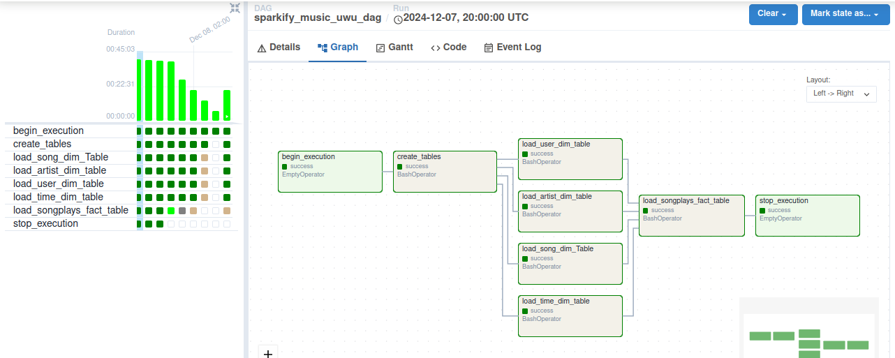

# Sparkify Data Pipeline Project

## Overview

This project demonstrates the creation of an ETL (Extract, Transform, Load) pipeline using **Apache Airflow** for scheduling and monitoring tasks, and **MySQL** as the storage solution. The project involves processing JSON data, transforming it, and storing it in a relational database modeled using a dimensional schema with one fact table and four dimension tables.

### Features:

- ETL pipeline to extract JSON data, transform it, and load it into MySQL.
- Dimensional modeling applied for optimal analytical queries.
- Scheduling of table creation and data loading using Apache Airflow.

---

## Project Workflow

### Dimensional Modeling

We use the following schema, designed for a music streaming service:

1. **Fact Table**:

   - **songplays**: Contains the records of user activities for song plays.

2. **Dimension Tables**:

   - **users**: User data.
   - **songs**: Songs data.
   - **artists**: Artist data.
   - **time**: Timestamps broken down into various time units.

Below is the Entity-Relationship (EER) diagram representing the database schema:


---

### Apache Airflow DAG

The data pipeline is implemented using an Airflow Directed Acyclic Graph (DAG) with the following tasks:

1. **begin\_execution**: Starts the workflow.
2. **create\_tables**: Creates the fact and dimension tables in the MySQL database.
3. **load\_\*\_dim\_table**: Loads data into the respective dimension tables.
4. **load\_songplays\_fact\_table**: Loads data into the fact table.
5. **stop\_execution**: Marks the workflow as complete.

Below is the Airflow DAG graph for the project:



---

## Project Components

### MySQL Database

- **Storage**: The data is stored in a MySQL relational database.
- **Schema**: Implements dimensional modeling principles for efficient querying.

### Apache Airflow

- **Scheduling**: Manages the task execution order as specified in the DAG.
- **Monitoring**: Tracks the success and failure of each task in the workflow.

---

## Setup Instructions

1. **Prerequisites**:

   - Python 3.x
   - Apache Airflow
   - MySQL Server
   - Data folder from https://github.com/alanchn31/Data-Engineering-Projects/tree/master/1.%20Postgres%20ETL

2. **Installation**:

   - Install Airflow:
     ```bash
     pip install apache-airflow
     ```
   - Install MySQL client:
     ```bash
     pip install mysql-connector-python
     ```

3. **Configure Airflow DAG**:

   - Place the DAG file (`sparkify_music_dag.py`) in the `dags/` folder of your Airflow home directory.
   - Update the MySQL connection details in the DAG file.

4. **Start Airflow**:

   - Initialize the database:
     ```bash
     airflow db init
     ```
   - Start the scheduler and webserver:
     ```bash
     airflow scheduler &
     airflow webserver
     ```

5. **Run the DAG**:

   - Navigate to the Airflow web UI and trigger the `sparkify_music_dag`.

---

## How It Works

1. The DAG starts with the `begin_execution` task.
2. Tables are created in the MySQL database.
3. Data is loaded into the dimension tables (`users`, `songs`, `artists`, and `time`).
4. The `songplays` fact table is populated using the dimension table data.
5. Finally, the DAG execution is marked complete.

---

## Acknowledgments

This project is inspired from the project PostgresETL and airflow Data Pipelining of alanchn31, where I used the same data but different tools like using mysql instead and only BashOperators and EmptyOperators.

