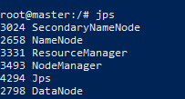
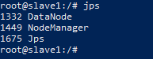
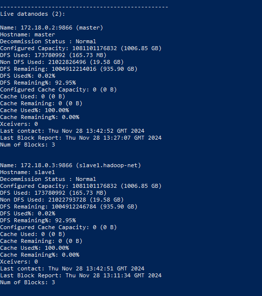
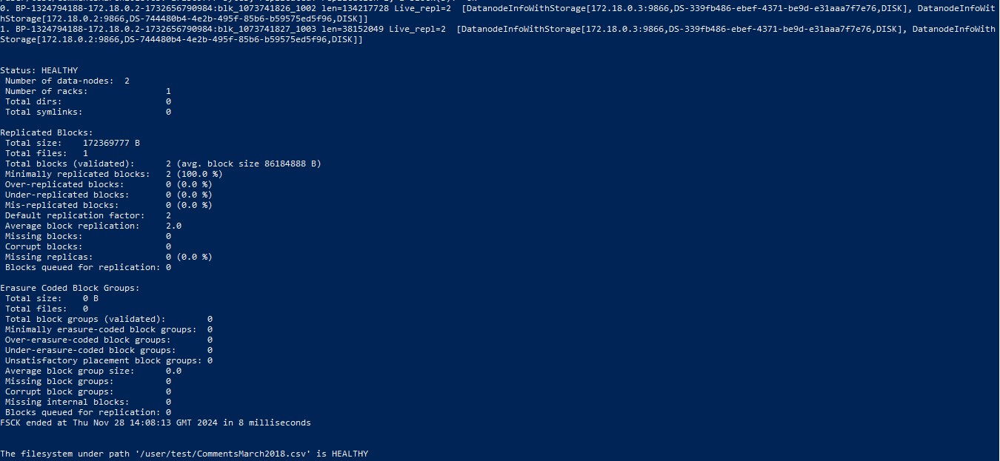
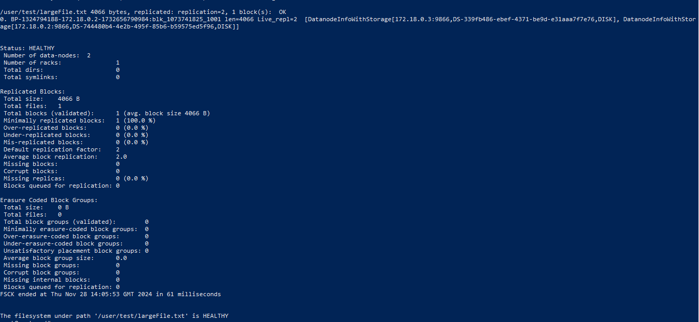

# README: Setting up a Hadoop Cluster (1 Master, 2 Slaves) using Docker Containers

## Introduction

This guide explains how to set up a Hadoop cluster with one master node and one slave nodes using Docker. The setup includes:
- HDFS (Hadoop Distributed File System) with replication.
- Namenode and Secondary Namenode on the Master node.
- Datanodes on both Master and Slave node.
  
By the end of this setup, you will be able to:
- Upload files to HDFS (Do a read/write request).
- Distribute files across multiple DataNodes with replication.

---

## Prerequisites

1. **Docker installed** on your system.
2. **Java installed** in the Hadoop environment.
3. Basic understanding of Hadoop architecture (Namenode, Datanode, HDFS).
These installations will be done via the dockerfile that you'll find in the folder.
---

## Steps to Set Up the Cluster

### Step 1: Prepare Docker Images and Containers
Before starting, make sure you're in the dir where dockfile exists.
1. **Pull or build a Hadoop image** with Java pre-installed:
   ```bash
   docker build -t hadoop-cluster .
   ```

2. **Start containers** for the master and two slaves:
   ```bash
   docker run -itd --name master --network hadoop-net hadoop-cluster
   docker run -itd --name slave1 --network hadoop-net hadoop-cluster
   ```

3. **Access the containers**:
   ```bash
   docker exec -it master bash
   docker exec -it slave1 bash
   ```

---

### Step 2: Hadoop and Yarn Configuration Files
#### 2.0 Creating Namenode and Datanode dir
You need first to create hdfs/namenode and hdfs/datanode in '/usr/local/hadoop/etc/hadoop' for master node. It is not necessary to create the datanome but since it's a small cluster, I added it. For slave nodes, you'll only need datanode directory.


#### 2.1 Edit Hadoop Configuration Files
The following configuration files are located in `/usr/local/hadoop/etc/hadoop/`.

1. **Edit `core-site.xml`** on all nodes:
   ```xml
   <configuration>
       <property>
           <name>fs.defaultFS</name>
           <value>hdfs://master:9000</value>
       </property>
   </configuration>
   ```

2. **Edit `hdfs-site.xml`** on all nodes:
   ```xml
   <configuration>
       <property>
           <name>dfs.replication</name>
           <value>2</value>
       </property>
       <property>
           <name>dfs.namenode.name.dir</name>
           <value>/usr/local/hadoop/hdfs/namenode</value>
       </property>
       <property>
           <name>dfs.datanode.data.dir</name>
           <value>/usr/local/hadoop/hdfs/datanode</value>
       </property>
   </configuration>
   ```

3. **Edit `yarn-site.xml`** on all nodes (if using YARN):
   ```xml
   <configuration>
       <property>
           <name>yarn.resourcemanager.hostname</name>
           <value>master</value>
       </property>
       <property>
           <name>yarn.nodemanager.aux-services</name>
           <value>mapreduce_shuffle</value>
       </property>
   </configuration>
   ```

4. **Edit `mapred-site.xml`** (if using MapReduce):
   ```xml
   <configuration>
       <property>
           <name>mapreduce.framework.name</name>
           <value>yarn</value>
       </property>
   </configuration>
   ```

5. **Update `workers` file** (on all nodes) in 'user/local/hadoop/etc/hadoop' :
   Add the following:
   ```
   master
   slave1
   ```

#### 2.2 Set Up Hadoop Environment

Modify the `hadoop-env.sh` file (`/usr/local/hadoop/etc/hadoop/hadoop-env.sh`) on **all nodes**. Add or update these lines:
   ```bash
   export JAVA_HOME=/usr/lib/jvm/java-11-openjdk-amd64
   export HDFS_NAMENODE_USER=root
   export HDFS_DATANODE_USER=root
   export HDFS_SECONDARYNAMENODE_USER=root
   export PATH=$PATH:$JAVA_HOME/bin:$HADOOP_HOME/bin:$HADOOP_HOME/sbin
  ```
#### 2.3 Set up Yarn Environment 
Modify the `hadoop-env.sh` file (`/usr/local/hadoop/etc/hadoop/yarn-env.sh`) on **all nodes**. Add or update these lines
```bash
   export YARN_RESOURCEMANAGER_USER=root
   export YARN_NODEMANAGER_USER=root
  ```

---

### Step 3: Format the Namenode

1. Go to the **master node**:
 ```bash
   docker exec -it master bash
   ```
 and run:
   ```bash
   hdfs namenode -format
   ```

3. You will see output indicating the Namenode has been successfully formatted.

---

### Step 4: Start Hadoop Services

1. **Start HDFS** on the master node:
   ```bash
   start-dfs.sh
   ```

2. **Start YARN** on the master node (if using YARN):
   ```bash
   start-yarn.sh
   ```

3. Verify the services on all nodes:
   ```bash
   jps
   ```

   - On **Master**, you should see:
     ```
     Namenode
     SecondaryNamenode
     Datanode
     ResourceManager (if using YARN)
     ```
     

   - On **Slave1**, you should see:
     ```
     Datanode
     NodeManager (if using YARN)
     ```
     


---

### Step 5: Verify the Cluster

1. Use the Hadoop Web UI to check the status of the cluster:
   - Namenode UI: `http://<master-ip>:9870`
   - ResourceManager UI (if YARN is enabled): `http://<master-ip>:8088`

2. Check the live DataNodes using:
   ```bash
   hdfs dfsadmin -report
   ```

---

### Step 6: Interact with HDFS

#### 6.1 Create a Directory in HDFS
```bash
hdfs dfs -mkdir -p /user/test
```

#### 6.2 Upload a File to HDFS
Create a sample text file on your local system:
```bash
echo "Hadoop is a distributed storage system." > hadoop.txt
```
or copy a file from your local system to the container 
```bash
docker cp /yourpath/CommentsMarch2018.csv slave1:/root/
```
Copy the file into HDFS:
```bash
hdfs dfs -put /path/to/hadoop.txt /user/test
hdfs dfs -put /path/to/CommentsMarch2018.csv /user/test
```

#### 6.3 Verify the File in HDFS
```bash
hdfs dfs -ls /user/test
```
#### 6.4 Checking the number of blocks per file and details
```bash
hdfs dfsadmin -report
```
 
 
 
- There are 3 blocks reported in the HDFS cluster, as indicated under "Num of Blocks" for both master and slave1. Since replication is set to 2, each block is replicated across two DataNodes (one on master and one on slave1).

  - For further details, we can see infos of each file in hdfs with the following command: 
```bash
hdfs fsck /user/test/CommentsMarch2018.csv -files -blocks -locations`
```
  

- **DataNodes in the Cluster**:  There are two DataNodes in the cluster: **master** and **slave1**.
- **Total Size**: The total size of the file stored in HDFS is **17,236,977 bytes (~17.2 MB)**.
- **Total Blocks**:  
   - The file is divided into **2 blocks**.  
   - Since the file's size exceeds the default HDFS block size of 128 MB, it is divided into smaller blocks.  
   - The **average block size** is **86,184,888 bytes (~86 MB)**.
     
- So, this file has 4 blocks (2 original and 2 copies) distributed in master and slave1 nodes.

- For the **second file**: It only has 2 blocks (1 copy and 1 original) since its size is less the blocks' default size.
  
    


---

### Step 7: Debugging Common Issues

1. **Java Not Found**: Ensure `JAVA_HOME` is correctly set in `hadoop-env.sh`.
2. **Missing Datanodes**:
   - Check the configuration of `hdfs-site.xml` on all nodes.
   - Ensure that the `dfs.datanode.data.dir` directory exists and has the correct permissions.
   -  Ensure to add the slaves (hostname or IP address) in the workers file in hadoop configurations.

---

### Summary of Commands

| **Action**              | **Command**                                           |
|--------------------------|-------------------------------------------------------|
| Build an image          | `docker build -t hadoop-cluster`                     |
| Create Container master from hadoop-cluster image  | ` docker run -itd --name master --network hadoop-net hadoop-cluster`                                                     |
| Go to a container (slave1) bash      |     `docker exec -it master bash`       |
|   exit from a container              |        `exit`                                   |
| Start HDFS              | `start-dfs.sh`                                       |
| Start YARN              | `start-yarn.sh`                                      |
| Check Cluster Status    | `hdfs dfsadmin -report`                               |
| Create HDFS Directory   | `hdfs dfs -mkdir /user/test`                          |
| Upload File to HDFS     | `hdfs dfs -put /path/to/file /user/test`              |
| List HDFS Contents      | `hdfs dfs -ls /user/test`                             |
|  Check the name of the file, block details, and where each block is stored      |   `hdfs fsck / -files -blocks -locations`              |
| stop HDFS               |  `stop-dfs.sh`                                        |
| stop YARN               | `stop-yarn.sh`                                        |
| Stop a container (master)       |   `stop master`                               |

---

## Additional Notes

1. **Persisting Data**: Since we're using Docker containers, it's good to mount volumes to preserve data and configurations when containers are restarted.
   ```bash
   docker run -itd --name master --network hadoop-net -v /host/data:/container/data hadoop-cluster
   ```
   or you can just stop each container and restart it. The data may persist.

2. **Scaling**: Add more slave nodes by starting additional containers and updating the `workers` file.
3. Converting bytes to megabytes (MB):
   - 1 MB = 1024 KB.
   - 1 KB = 1024 bytes.
