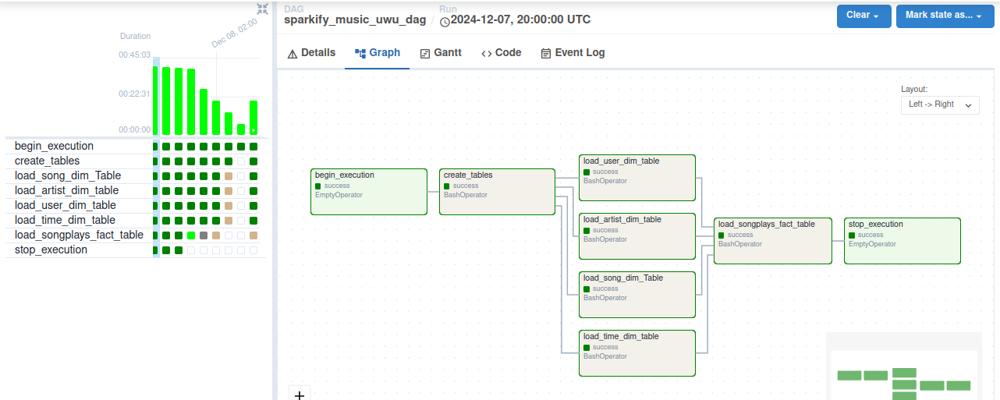

# Data Engineering Projects

This repository contains a collection of data engineering projects, showcasing skills in Big Data, ETL processes, and workflow automation.

---

## Projects

### 1. **Big Data Project**

    
   - Description: A project focused on leveraging Big Data technologies to process and analyze large datasets.
   - Status: Active

### 2. **ETL with MySQL and Airflow**

   

       
   - Description: A project implementing an ETL pipeline using MySQL as the data source and Apache Airflow for workflow orchestration.
   - Key Feature: Includes a DAG file for scheduling and managing tasks.
   - Status: Last updated last month.

### 3. **Hadoop Cluster with Docker**
   - Description: A project demonstrating how to set up and manage a Hadoop cluster using Docker for distributed data processing.
   - Status: Last updated 2 months ago.

### 4. **Scheduling a Simple ETL with Airflow in Linux**

   - Description: A project to automate a simple ETL process on a Linux environment using Apache Airflow.
   - Status: Complete

